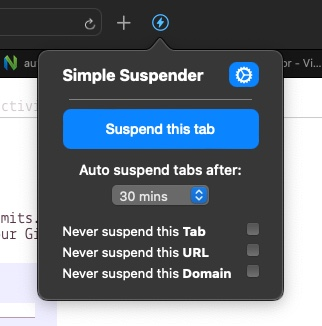

# Simple Suspender

[![license][license-image]][license-url]

[license-url]: https://github.com/tldr-pages/tldr/blob/main/LICENSE.md
[license-image]: https://img.shields.io/github/license/abayomi185/simple-suspender?color=greeen

Simple Suspender, tab suspender built for Safari and cross compatible with Firefox (Chrome's browser API has a different name, 'Find and Replace All' would make it in Chromium based browsers).

## Possible additions if requested:
- Whitelist list
- Customisable Keyboard Shortcuts

## To-do:
- [ ] Favicon
- [ ] Loop through and suspend at intervals
- [ ] Check: manage state and saving to local state
- [ ] Use url params if tab info not available (e.g after restart)

## Limitations:
- Safari nukes tab history when tab is updated initially for "Privacy" it seems
